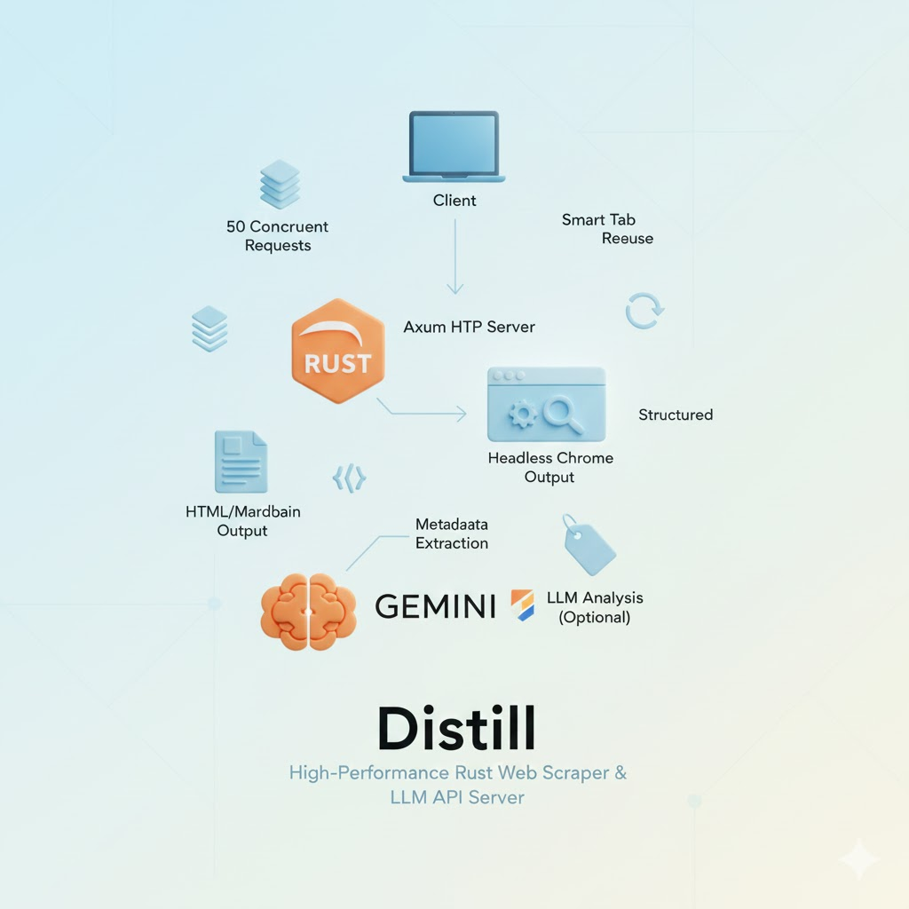
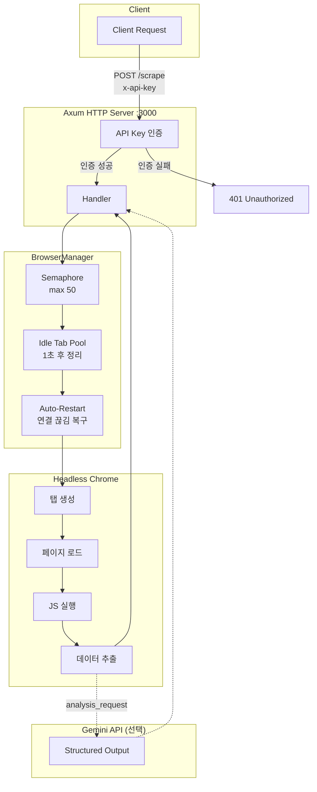
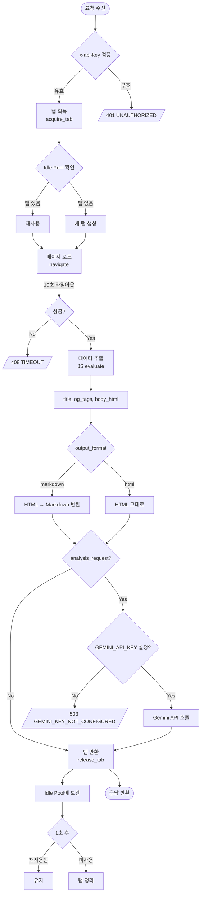

# Distill

고성능 Rust 기반 웹 스크래퍼 & LLM 분석 API 서버



## 개요

Distill은 웹 페이지를 스크래핑하고, 선택적으로 LLM(Gemini)을 통해 콘텐츠를 분석하는 REST API 서버입니다.

### 주요 기능

- **웹 스크래핑**: Headless Chrome으로 JavaScript 렌더링된 페이지 지원
- **포맷 변환**: HTML 또는 Markdown으로 출력
- **메타데이터 추출**: 페이지 제목, Open Graph 태그 자동 추출
- **LLM 분석**: Gemini API를 통한 구조화된 콘텐츠 분석
- **고성능**: 최대 50개 동시 요청, 스마트 탭 재사용
- **API 인증**: API 키 기반 접근 제어

---

## 아키텍처



---

## 요청 흐름



---

## 프로젝트 구조

```
src/
├── main.rs        # 서버 진입점, 라우터 설정
├── browser.rs     # BrowserManager - 탭 라이프사이클 관리
├── handlers.rs    # API 핸들러 (/scrape, /health)
├── llm.rs         # Gemini API 클라이언트
├── models.rs      # 요청/응답 타입 정의
├── error.rs       # 커스텀 에러 타입
└── bin/
    └── loadtest.rs  # 부하 테스트 도구
```

---

## 환경 변수

| 변수 | 필수 | 기본값 | 설명 |
|------|:----:|--------|------|
| `API_KEY` | ✅ | `changeme` | API 인증 키 |
| `GEMINI_API_KEY` | | - | Gemini API 키 (LLM 분석 사용 시 필수) |
| `PORT` | | `3000` | 서버 포트 |
| `MAX_CONCURRENT_TABS` | | `50` | 최대 동시 브라우저 탭 수 |
| `ALLOWED_ORIGINS` | | `*` | CORS 허용 origin (쉼표 구분, 예: `https://example.com,https://api.example.com`) |

---

## 빠른 시작

### 실행

```bash
# 환경 변수 설정 후 실행
API_KEY=your-secret-key GEMINI_API_KEY=your-gemini-key cargo run
```

서버가 `http://localhost:3000`에서 시작됩니다.

### API 호출 예시

**스크래핑만:**

```bash
curl -X POST http://localhost:3000/scrape \
  -H "Content-Type: application/json" \
  -H "x-api-key: your-secret-key" \
  -d '{
    "url": "https://example.com",
    "output_format": "markdown"
  }'
```

**LLM 분석 포함:**

```bash
curl -X POST http://localhost:3000/scrape \
  -H "Content-Type: application/json" \
  -H "x-api-key: your-secret-key" \
  -d '{
    "url": "https://example.com",
    "output_format": "markdown",
    "analysis_request": {
      "model": "gemini-3-flash-preview",
      "prompt": "이 페이지의 핵심 내용을 요약해줘",
      "response_schema": {
        "type": "OBJECT",
        "properties": {
          "summary": { "type": "STRING" },
          "keywords": { "type": "ARRAY", "items": { "type": "STRING" } }
        },
        "required": ["summary"]
      }
    }
  }'
```

**헬스 체크:**

```bash
curl http://localhost:3000/health
```

---

## API 명세

### POST /scrape

#### Headers

| 헤더 | 필수 | 설명 |
|------|:----:|------|
| `x-api-key` | ✅ | API 인증 키 |

#### Request Body

| 필드 | 타입 | 필수 | 설명 |
|------|------|:----:|------|
| `url` | string | ✅ | 스크래핑할 URL |
| `output_format` | string | | `"markdown"` (기본) 또는 `"html"` |
| `analysis_request` | object | | LLM 분석 요청 |

**analysis_request:**

| 필드 | 타입 | 필수 | 설명 |
|------|------|:----:|------|
| `model` | string | | 모델명 (기본: `gemini-3-flash-preview`) |
| `prompt` | string | ✅ | 분석 프롬프트 |
| `response_schema` | object | ✅ | Gemini Structured Output 스키마 |

#### Response

```json
{
  "success": true,
  "data": {
    "metadata": {
      "title": "Example Domain",
      "og_tags": {
        "og:title": "Example",
        "og:description": "..."
      }
    },
    "content": "# Example Domain\n\nThis domain is for...",
    "analysis_result": {
      "summary": "...",
      "keywords": ["example", "domain"]
    },
    "analysis_error": null
  },
  "error": null
}
```

> **참고**: LLM 분석이 실패해도 스크래핑 결과는 반환됩니다. 이 경우 `analysis_result`는 `null`이고 `analysis_error`에 에러 메시지가 포함됩니다.

---

## 성능 특성

| 항목 | 값 | 설명 |
|------|-----|------|
| 최대 동시 요청 | 50 | Semaphore로 제어 |
| 탭 유휴 시간 | 1초 | 이후 자동 정리 |
| 페이지 타임아웃 | 10초 | 초과 시 에러 반환 |
| 브라우저 유휴 | 10분 | 이후 자동 종료 (재요청 시 재시작) |

---

## 부하 테스트

```bash
# 터미널 1: 서버 실행
API_KEY=test-key cargo run

# 터미널 2: 부하 테스트 (100개 요청)
API_KEY=test-key cargo run --bin loadtest
```

---

## 에러 코드

| 코드 | HTTP | 설명 |
|------|:----:|------|
| `UNAUTHORIZED` | 401 | API 키 인증 실패 |
| `TIMEOUT_EXCEEDED` | 408 | 페이지 로딩 10초 초과 |
| `INVALID_REQUEST` | 400 | 잘못된 요청 |
| `BROWSER_ERROR` | 500 | 브라우저/탭 오류 |
| `LLM_PROVIDER_ERROR` | 502 | Gemini API 오류 |
| `GEMINI_KEY_NOT_CONFIGURED` | 503 | Gemini API 키 미설정 |

---

## 기술 스택

- **Axum** - 웹 프레임워크
- **Tokio** - 비동기 런타임
- **headless_chrome** - 브라우저 자동화
- **reqwest** - HTTP 클라이언트
- **htmd** - HTML → Markdown 변환
